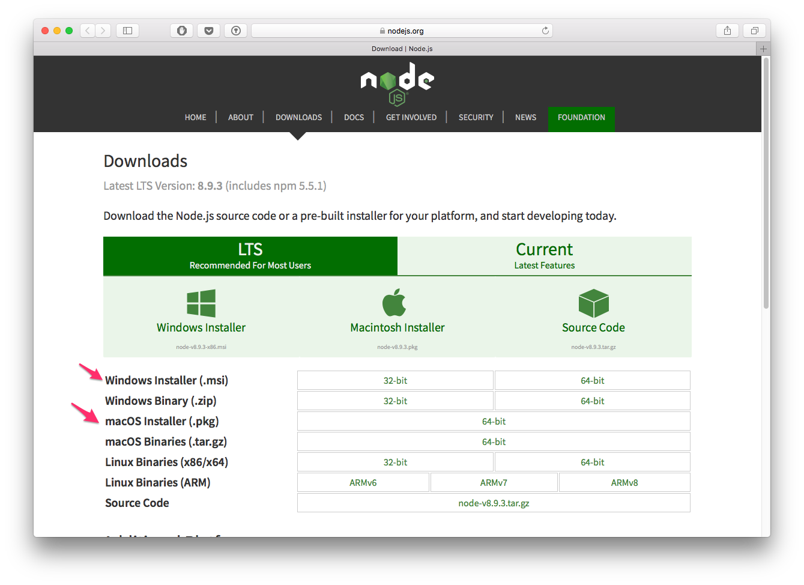
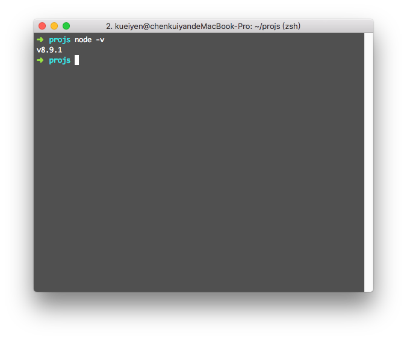

#  Node.js 安裝


> 本教材撰寫於 Node.js 版本：v8.9.1

## 簡介

Node.js 是 JavaScript 語言的伺服器端執行環境與擴充套件 lib，同時透過自行開發的 libuv 提供系統層級的 API。

以下取四點簡單描述 Node 特色：

- Node.js 1.x~3.x 叫做 `io.js`，參考 - [Node.js与io.js那些事儿](http://www.infoq.com/cn/articles/node-js-and-io-js)
- JavaScript 語言透過 Node.js 可以脫離瀏覽器在後端執行
- Node.js 是基於 Google 的 V8 JavaScript 引擎開發
- Node.js 透過 `libuv` 提供大量的 API 讓我們能使用 JavaScript 語言與系統互動（e.g 讀取/寫入檔案/執行其他程式...etc）
- Node 的套件管理系統 `npm` 是全世界最大的開源軟體生態系

#### 參考連結
- [Node.js](https://nodejs.org/en/)

## 安裝與更新
連結到 [`Download | Node.js`](https://nodejs.org/en/download/) 可以下載最新版本的 Node.js 執行環境。

### 版本選擇

下載頁面會提示可以取得 `LTS` 與 `Current` 兩種版本。

軟體術語 `LTS` 指的是 `Long Term Support`，表示會對該版本提供長期支援，換句話說就是比較穩定的版本，可能會提供相對保守的功能。

而 `Current` 則是目前最新的 Node 版本，包含一些比較實驗性質的功能。相對於 `LTS` 可能會稍不穩定，同時某些 Node 套件也可能不相容此環境。

本教材在 Node 版本 `v8.9.1` 下撰寫而成，相容於最新的 `v8.9.3`。

### 安裝
請直接下載對應系統的安裝包，使用預設值安裝即可。



安裝完成之後，可以使用以下指令查詢目前使用的 Node 版本。

```shell
$ node --version
# or
$ node -v
```

### Windows


### Mac


---

## 練習
- 自行安裝 Node.js 環境於你自己的系統上
- 使用上列指令確認你的 Node 版本
- 回覆你的練習結果：`完成` / `失敗，因為...(簡述原因)`